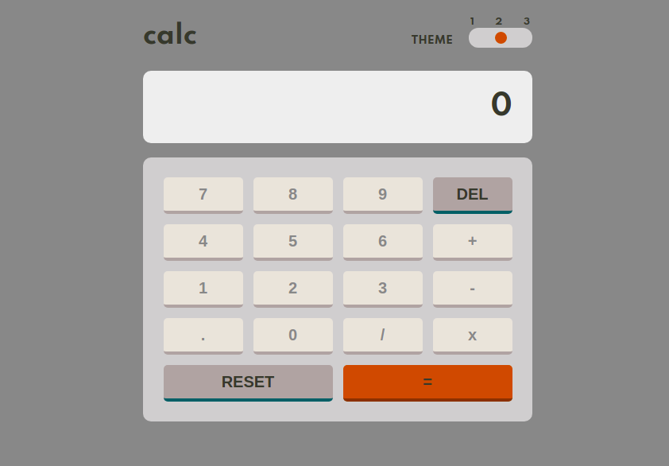

# Frontend Mentor - Calculator app solution

This is a solution to the [Calculator app challenge on Frontend Mentor](https://www.frontendmentor.io/challenges/calculator-app-9lteq5N29). Frontend Mentor challenges help you improve your coding skills by building realistic projects. 

## Table of contents

- [Overview](#overview)
  - [The challenge](#the-challenge)
  - [Screenshot](#screenshot)
  - [Links](#links)
- [My process](#my-process)
  - [Built with](#built-with)
  - [What I learned](#what-i-learned)
  - [Continued development](#continued-development)
  - [Useful resources](#useful-resources)
- [Author](#author)
- [Acknowledgments](#acknowledgments)

**Note: Delete this note and update the table of contents based on what sections you keep.**

## Overview

### The challenge

Users should be able to:

- See the size of the elements adjust based on their device's screen size
- Perform mathmatical operations like addition, subtraction, multiplication, and division
- Adjust the color theme based on their preference
- **Bonus**: Have their initial theme preference checked using `prefers-color-scheme` and have any additional changes saved in the browser

### Screenshot



### Links

- Solution URL: [Add solution URL here](https://your-solution-url.com)
- Live Site URL: [Add live site URL here](https://your-live-site-url.com)

## My process

### Built with

- Semantic HTML5 markup
- CSS custom properties
- Flexbox
- CSS Grid
- Responsive design
- Mobile-first workflow
- Vanilla JS
- Ecmascript 6+

### What I learned

In this project I learned about properties that are not standardized in browsers by means of --webkit --moz --ms styles.
And to customize an input of type range thanks to these.
How to select DOM elements via [data-attributes].
I was also able to practice my JS knowledge using Ecmascript 6+ functionalities.

```html
<div class="slider-container">
  <h4 class="theme-title">THEME</h4>
  <input type="range" name="slider" min="1" max="3" value="1" id="slider" />
</div>
```
```css
#slider::-webkit-slider-thumb {
    width: 15px;
    height: 15px;
    background-color: var(--secondary-color);
    border-radius: 50%;
    cursor: pointer;
}
```
```js
calculate(){
    let [num1, operation, num2] = this.operand.split(" ");
    num1 = parseFloat(num1);
    num2 = parseFloat(num2);
    const typeOperation = {
        "+" :  num1 + num2, 
        "-" :  num1 - num2, 
        "/" :  num1 / num2, 
        "x" :  num1 * num2, 
    }
    this.operand = `${typeOperation[operation]}`;
}

```

### Continued development

I did realize this project to practice my skills and use all what I am learning, actually.
In my next projects I go to implement my knowledge in Node.js too, to make a site with persistence of information they.


### Useful resources

- [CSS-Tricks](https://css-tricks.com/styling-cross-browser-compatible-range-inputs-css/) - This article helped me to understand how to do for styling the input of the calculator.


## Author

- Website - [Omar Dario Melendrez (https://omardario.online)


## Acknowledgments

Like ever I Acknowledgments to my family for support me in my long hours when I dont exist because I am learning or coding with so much will.

